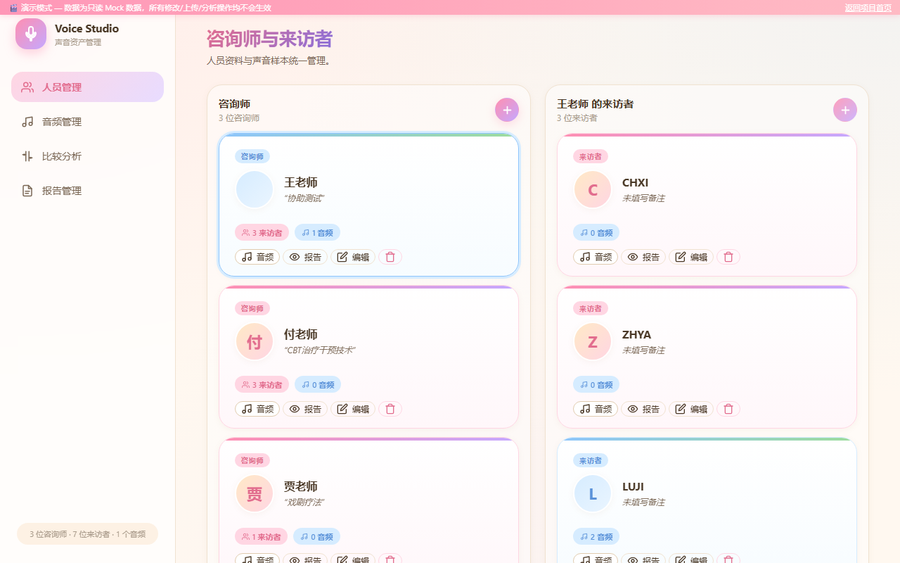
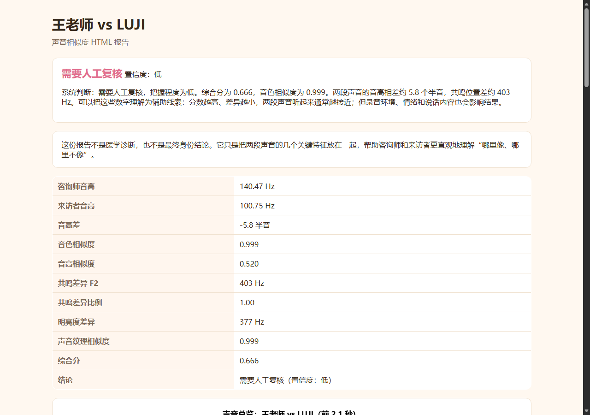
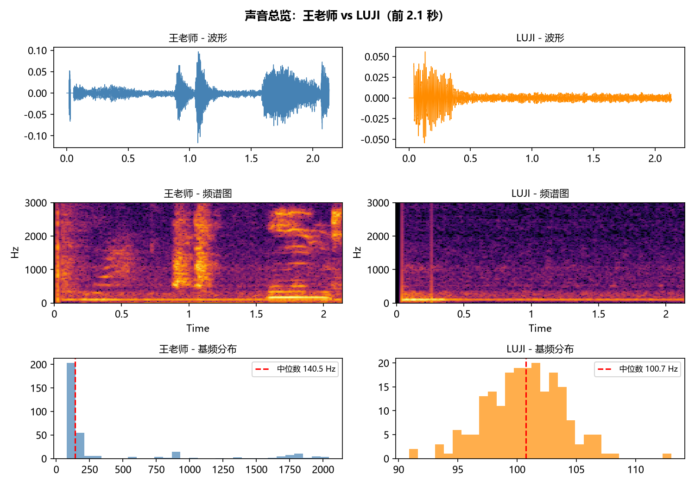
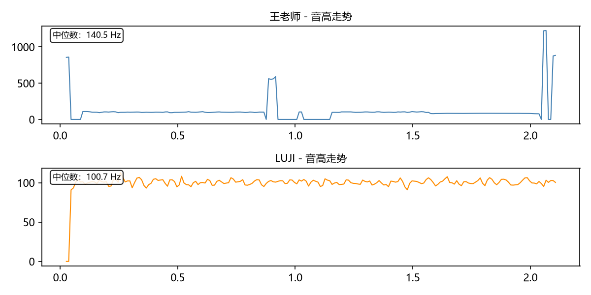
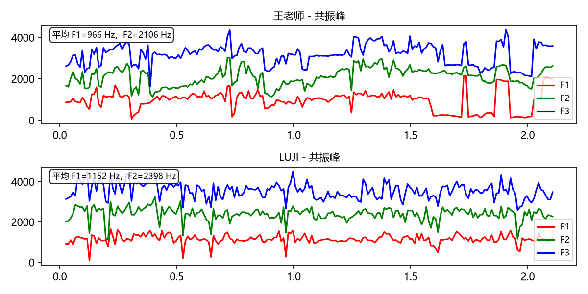

# RVC Voice Studio

本地声音相似度分析与人员、音频、报告管理系统。前端是单页应用，后端使用 Flask，数据保存在本地 SQLite。

## 功能

- 人员管理：咨询师、来访者两列管理，支持头像、性别、备注、音频和相关报告。
- 音频管理：支持上传、录音、重命名、删除、基础声学指标提取和转文字备注。
- 咨询师音频标签：支持"原音"和"变音"，变音可指定对应来访者。
- 分析报告：支持单人报告和双人报告，报告为中文 HTML，并可在报告管理页查看或删除。
- 数据整理：所有运行时产物统一放在 `output/` 下，根目录只保留源码、脚本、示例和配置。

## 界面预览

> **在线演示**：[cochranek.github.io/RVC_factor/demo](https://cochranek.github.io/RVC_factor/demo/)

### 人员管理


### 报告分析
双人声音相似度对比报告，包含音高、共振峰、频谱质心等声学指标的完整分析：



### 音频谱图
Python 声学分析生成的图表（以双人对比为例）：

| 总览图 | 音高走势 |
|---|---|
|  |  |

| 共振峰特征 |
|---|
|  |

## 快速开始

```bash
python -m venv .venv
.venv\Scripts\python -m pip install -r requirements.txt
python app.py
```

然后打开：

```text
http://127.0.0.1:5000
```

Windows 下也可以双击 `RVC_factor.bat` 启动。

## 项目结构

```text
RVC_factor/
├── app.py                  # Flask 路由和 REST API
├── core.py                 # 声学分析、图表和报告核心逻辑
├── db.py                   # SQLite 持久化
├── static/                 # 前端单页应用
├── samples/audio/          # 示例 wav 样本
├── scripts/                # 启动辅助脚本
├── tests/                  # 冒烟测试
├── legacy/                 # 旧版 Tkinter 桌面程序
├── output/                 # 本地运行时数据，默认不提交
│   ├── rvc.db              # SQLite 数据库
│   ├── uploads/audio/      # 上传或录音生成的音频
│   ├── uploads/avatars/    # 人员头像
│   ├── picture/            # 报告图表 PNG
│   ├── report/             # HTML / Word 报告输出
│   └── logs/               # 本地服务日志
├── requirements.txt
├── Dockerfile
└── RVC_factor.bat
```

## 数据模型

```text
counselors    (id, name, sex, avatar_path, note, created_at)
clients       (id, counselor_id, name, sex, avatar_path, note, created_at)
audio_samples (id, person_type, person_id, stored_filename, original_name,
               pitch_hz, gender, duration, rms, zcr, centroid, transcript,
               audio_role, target_client_id, uploaded_at)
reports       (id, a_audio_id, b_audio_id, counselor_id, client_id,
               audio_role, report_type, title, html_filename, created_at)
```

## Docker

```bash
docker build -t rvc-factor .
docker run -d -p 5000:5000 -v rvc-data:/app/output --name rvc rvc-factor
```

挂载的 volume `rvc-data` 保存 `output/` 下的数据库、上传文件、报告、图表和日志，容器重启后不会丢。

## 测试

先启动服务，再运行：

```bash
.\.venv\Scripts\python.exe tests\smoke_test.py
```
